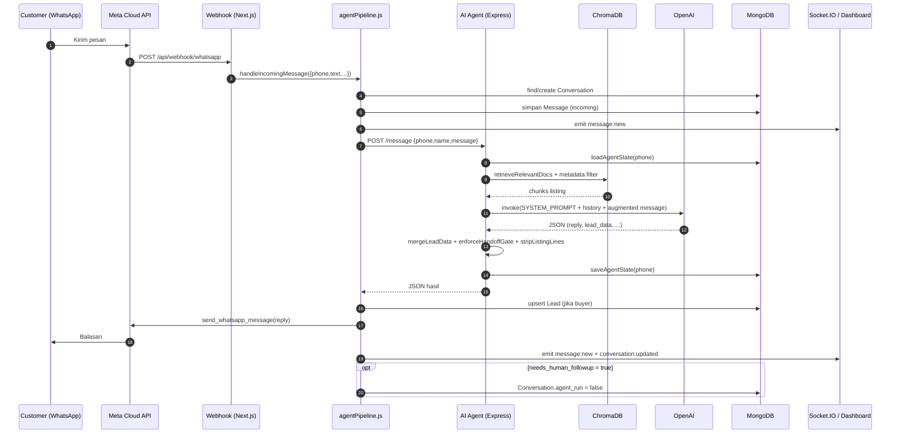

# LCM — Implementation Guide

**Lead Control Management (LCM)** — Panduan implementasi arsitektur AI WhatsApp Real Estate CRM.

> Dokumen ini menjelaskan bagaimana sistem LCM bekerja secara end-to-end, dari pesan WhatsApp masuk sampai lead tersimpan di MongoDB dan di-handoff ke manusia. Seluruh referensi kode menggunakan format `path/file:line` dan divalidasi terhadap kondisi codebase saat ini (branch `rework`).

---

## Daftar Isi

1. [Executive Summary & Arsitektur Sistem](#1-executive-summary--arsitektur-sistem)
2. [Deep Dive: AI Agent & RAG Pipeline](#2-deep-dive-ai-agent--rag-pipeline)
3. [Lead Extraction & Deterministic Gate](#3-lead-extraction--deterministic-gate)
4. [Integration Flow: WhatsApp Webhook & Database Sync](#4-integration-flow-whatsapp-webhook--database-sync)
5. [Operational Guide & Infrastruktur](#5-operational-guide--infrastruktur)
6. [Lampiran](#6-lampiran)

---

## 1. Executive Summary & Arsitektur Sistem

### 1.1 Ringkasan

LCM adalah platform CRM real-estate single-tenant di mana **WhatsApp menjadi kanal komunikasi utama** dan sebuah **AI sales agent** bertindak sebagai representatif penjualan: memahami intent pembeli, mengumpulkan data lead secara natural, menampilkan listing yang benar-benar ada di knowledge base (RAG), lalu menyerahkan lead siap-follow-up kepada agen manusia.

Sistem dibangun dari dua aplikasi yang berjalan terpisah:

| Aplikasi | Teknologi | Peran |
|---|---|---|
| **Frontend + Orkestrator** | Next.js 16 (App Router), custom `server.js`, Socket.IO | Menerima webhook WhatsApp, menyimpan pesan/conversation, menjalankan pipeline agent, menyajikan dashboard real-time |
| **AI Agent Service** | TypeScript, Express, LangChain, ChromaDB client, OpenAI | Reasoning LLM, RAG retrieval, ekstraksi lead, scoring, gate deterministik, manajemen PDF & vector store |

Keduanya berbagi **satu database MongoDB** (`lcm`) dan berkomunikasi lewat HTTP (`POST /message`) dengan kontrak JSON yang ketat.

### 1.2 Prinsip Desain Utama

1. **Grounding / anti-halusinasi** — Agent hanya boleh menyebut properti yang muncul di konteks `[KNOWLEDGE BASE]` hasil retrieval Chroma. Tidak boleh mengarang listing, harga, ukuran, atau area.
2. **Deterministic over probabilistic** — Aturan bisnis kritis (handoff hanya setelah budget + area + property_type lengkap; listing tidak boleh tampil sebelum budget diketahui) ditegakkan oleh **kode deterministik**, bukan hanya instruksi prompt (`handoff.ts`, `leadState.ts`).
3. **Stateless-safe** — Riwayat percakapan dan akumulasi data lead dipersist ke `conversations.agent_state`, sehingga konteks tidak hilang saat container agent restart (`sessionStore.ts`).
4. **Single-tenant** — Satu deployment untuk satu bisnis. Tidak ada `workspace_id`; kredensial WhatsApp dan profil perusahaan disimpan pada satu dokumen `Settings`.
5. **Pemisahan domain data** — Lead pembeli (`leads`) dan inventory properti (`inventory`) selalu berada di collection terpisah dan tidak pernah dicampur.

### 1.3 Topologi Layanan

```
┌────────────────────────────────────────────────────────────────────┐
│                        Browser / Dashboard                          │
│   Conversations · CRM Leads · Inventory · RAG · Settings           │
└───────────────┬────────────────────────────────────┬───────────────┘
                │ HTTP (REST API routes)              │ Socket.IO
                ▼                                     ▼
┌────────────────────────────────────────────────────────────────────┐
│              Next.js App Router + server.js (port 3000)             │
│  ┌──────────────────┐  ┌──────────────────┐  ┌──────────────────┐  │
│  │ /api/webhook/...  │  │ /api/dashboard/* │  │ Auth (JWT)       │  │
│  └────────┬─────────┘  └──────────────────┘  └──────────────────┘  │
│           │                                                         │
│           ▼                                                         │
│  lib/agentPipeline.js  ── handleIncomingMessage()                   │
│           │                                                         │
│           ├── Conversation / Message / Lead (Mongoose)              │
│           ├── lib/whatsapp.js  ──► Meta Graph API v19.0             │
│           └── fetch POST /message ──┐                               │
└─────────────────────────────────────┼───────────────────────────────┘
                                      │
                                      ▼
┌────────────────────────────────────────────────────────────────────┐
│         AI Agent Service (Express, container port 8080 → 5000)      │
│  agent.ts · handoff.ts · leadState.ts · sessionStore.ts · rag.ts    │
│           │                          │                    │         │
│           ▼                          ▼                    ▼         │
│      OpenAI gpt-4o-mini        ChromaDB (8000)      MongoDB (27017)  │
│      text-embedding-3-small    collection "lcm"     agent_state,     │
│      (RAG embedding)                               inventory,       │
│                                                    documents         │
└────────────────────────────────────────────────────────────────────┘
```

### 1.4 Alur End-to-End (High Level)

```
Pesan WhatsApp pelanggan
        │
        ▼
Meta Cloud API ──► POST /api/webhook/whatsapp  (app/api/webhook/whatsapp/route.js:32)
        │
        ▼
handleIncomingMessage()  (lib/agentPipeline.js:46)
        │  1. find-or-create Conversation
        │  2. simpan Message masuk (idempoten by whatsapp_message_id)
        │  3. emit Socket.IO message:new
        │
        ▼
POST http://ai-agent:8080/message  (lib/agentPipeline.js:111)
        │
        ▼
processMessage()  (ai-agent/src/agent.ts:377)
        │  ├── load/hydrate agent_state  (ai-agent/src/sessionStore.ts:57)
        │  ├── buildRagContext()          (ai-agent/src/agent.ts:336)  ──► ChromaDB
        │  ├── LLM ChatOpenAI gpt-4o-mini (ai-agent/src/agent.ts:398)
        │  ├── parse JSON + mergeLeadData/backfill
        │  ├── enforceHandoffGate()       (ai-agent/src/handoff.ts:66)
        │  ├── stripListingLines() gate   (ai-agent/src/agent.ts:467)
        │  └── persist agent_state        (ai-agent/src/sessionStore.ts:72)
        │
        ▼
JSON { reply, user_type, lead_data, lead_score,
       lead_status, next_action, needs_human_followup }
        │
        ▼
agentPipeline.js
        │  ├── upsert Lead (bila user_type=buyer)   (:196)
        │  ├── deliverReply() → send_whatsapp_message (:234)
        │  ├── emit Socket.IO (message:new, conversation:updated)
        │  └── bila needs_human_followup → agent_run=false (:143)
        │
        ▼
Balasan WhatsApp terkirim + Dashboard ter-update real-time
        │
        ▼
Handoff: agen manusia menindaklanjuti lead (agent_run dimatikan)
```

### 1.5 Diagram Urutan (Mermaid)



### 1.6 Tabel Tanggung Jawab Komponen

| Komponen | File Kunci | Tanggung jawab |
|---|---|---|
| Webhook handler | `app/api/webhook/whatsapp/route.js` | Verifikasi Meta, parsing payload, validasi `phone_number_id`, deduplikasi event |
| Pipeline orkestrator | `lib/agentPipeline.js` | Persistensi pesan, pemanggilan agent, upsert lead, pengiriman balasan, Socket.IO, auto-disable agent |
| AI reasoning & state | `ai-agent/src/agent.ts` | Prompt, pemanggilan LLM, perakitan konteks, orkestrasi gate |
| Gate deterministik | `ai-agent/src/handoff.ts` | `hasKeyInfo`, `enforceHandoffGate`, `stripHandoffPhrase` |
| Akumulasi data lead | `ai-agent/src/leadState.ts` | `mergeLeadData`, scoring, `buildKnownDataBlock`, `stripListingLines` |
| Persistensi session | `ai-agent/src/sessionStore.ts` | Baca/tulis/hapus `conversations.agent_state` |
| RAG & vector store | `ai-agent/src/rag.ts` | Chunking, embedding, ingest, retrieval, metadata filter |
| API agent | `ai-agent/src/index.ts` | 12 route Express (message, reset, health, RAG, PDF) |
| WhatsApp sender | `lib/whatsapp.js` | Kirim teks via Meta Graph API atau mock (test mode) |
| Settings singleton | `lib/settings.js` + `models/Settings.js` | Kredensial WhatsApp, toggle integrasi |

---

## 2. Deep Dive: AI Agent & RAG Pipeline

Seluruh logika agent berada di `ai-agent/src/`. Entry point adalah Express (`index.ts`), sedangkan otak percakapan ada di `agent.ts`.

### 2.1 System Persona & Prompt Engineering

`SYSTEM_PROMPT` didefinisikan sebagai konstanta di `ai-agent/src/agent.ts:32-183`. Struktur prompt dibagi menjadi beberapa blok:

| Blok Prompt | Isi | Lokasi |
|---|---|---|
| Personality | Profesional, sopan, ringkas; **tidak pernah** mengaku "I am an AI" | `ai-agent/src/agent.ts:35-37` |
| Language | Default Bahasa Indonesia; mirror bahasa pelanggan jika berbeda | `ai-agent/src/agent.ts:39-40` |
| Knowledge Base Context | Aturan anti-halusinasi: hanya boleh menyajikan properti dari `[KNOWLEDGE BASE]` | `ai-agent/src/agent.ts:42-45` |
| Available Areas Context | Fallback bila area yang diminta tidak punya listing | `ai-agent/src/agent.ts:47-49` |
| Customer Identity | Nomor & nama pelanggan sudah disuplai; dilarang menanyakannya | `ai-agent/src/agent.ts:51-54` |
| Property Types | Hanya: Rumah, Ruko, Tanah, Apartemen, Komersial, Villa | `ai-agent/src/agent.ts:56-57` |
| Conversation Flow (STRICT) | STEP 1–5: intent → tanya yang kurang → tampilkan listing → fallback → handoff | `ai-agent/src/agent.ts:59-100` |
| Output Format | JSON valid dengan shape tetap | `ai-agent/src/agent.ts:102-121` |
| Few-shot examples | Contoh lengkap dengan budget, dan contoh tanpa budget | `ai-agent/src/agent.ts:123-159` |
| Rules (STRICT) | Klasifikasi tiap turn, gate handoff, scoring, aturan memory — inventaris lengkap di [2.7](#27-aturan-agent--lapisan-penegakan-rules-set) | `ai-agent/src/agent.ts:161-182` |

**Batasan anti-halusinasi** dinyatakan eksplisit di prompt:

- `ai-agent/src/agent.ts:45` — "NEVER invent listings, prices, sizes, or areas. Only present properties that appear in `[KNOWLEDGE BASE]`."
- `ai-agent/src/agent.ts:90-91` — jika tidak ada listing yang cocok, katakan jujur dan sebutkan area yang tersedia dari `[AVAILABLE AREAS]`; "Never invent a listing to fill the gap."
- `ai-agent/src/agent.ts:84` — listing hanya boleh ditampilkan bila `AREA` diketahui **dan** budget + property_type diketahui.

Namun, karena LLM bersifat probabilistik, aturan tersebut **di-backup oleh kode deterministik** (lihat Bagian 3). Prompt adalah lapisan pertama; gate adalah lapisan kedua yang tidak bisa dilanggar.

### 2.2 Perakitan Konteks per Turn

Pada `processMessage()` (`ai-agent/src/agent.ts:377`), pesan yang dikirim ke LLM tidak hanya input user. Urutan perakitannya (`ai-agent/src/agent.ts:405-421`):

```
messagesForLlm = [
  SystemMessage(SYSTEM_PROMPT),
  ...session.history,                       // hingga 20 turn terakhir
  HumanMessage(augmentedMessage)
]
```

Di mana `augmentedMessage` (`ai-agent/src/agent.ts:414-415`) disusun berurutan:

```
identityContext  →  "[Customer Phone: <phone>] [Customer Name: <name>]\n\n"
knownBlock       →  "[KNOWN CUSTOMER DATA]\n...\n[/KNOWN CUSTOMER DATA]\n\n"
ragContext       →  "[AVAILABLE AREAS]...\n[KNOWLEDGE BASE]...\n[/KNOWLEDGE BASE]\n\n"
schemaReminder   →  "[SYSTEM REMINDER] Reply with ONLY the JSON object..."
userMessage      →  pesan asli pelanggan
```

`schemaReminder` menyuntikkan daftar field yang masih missing secara dinamis, mis. `Fields still missing: budget, size` (`ai-agent/src/agent.ts:408-413`), sehingga LLM diarahkan hanya menanyakan yang belum ada.

### 2.3 Deterministic Memory: `[KNOWN CUSTOMER DATA]`

Masalah yang diselesaikan: LLM sering lupa data yang sudah diberikan pelanggan beberapa turn sebelumnya, sehingga menanyakan pertanyaan yang sama berulang.

Solusinya deterministik dan tidak bergantung pada ingatan LLM:

1. Setiap turn, hasil ekstraksi `lead_data` di-merge ke `session.known` (`ai-agent/src/agent.ts:452`).
2. `buildKnownDataBlock(session.known)` (`ai-agent/src/leadState.ts:103`) membangun blok teks berisi field yang sudah diketahui dan instruksi "NEVER ask for them again".
3. Blok ini disuntik ke prompt setiap turn.

```text
[KNOWN CUSTOMER DATA]
area=Kelapa Gading; property_type=Rumah
These values are ALREADY known — NEVER ask for them again.
Still missing: budget, size, purpose.
[/KNOWN CUSTOMER DATA]
```

Referensi implementasi:
- `mergeLeadData` — hanya nilai non-kosong yang menimpa; field yang tidak disebut turn berikutnya tidak pernah terhapus (`ai-agent/src/leadState.ts:59-67`).
- `backfillLeadData` — melengkapi hasil ekstraksi per-turn dari akumulasi known data (`ai-agent/src/leadState.ts:73-78`).
- `missingFields` — daftar field yang belum terisi (`ai-agent/src/leadState.ts:80-82`).

### 2.4 RAG Pipeline — Chunking, Embedding, Retrieval

Modul RAG ada di `ai-agent/src/rag.ts`. Klien Chroma dibuat sekali dan collection di-`getOrCreate` secara lazy (`ai-agent/src/rag.ts:8`, `ai-agent/src/rag.ts:19-26`).

Konfigurasi:

| Parameter | Nilai | Lokasi |
|---|---|---|
| Chroma URL | `process.env.CHROMA_URL` (default `http://localhost:8000`) | `ai-agent/src/rag.ts:5` |
| Nama collection | `process.env.CHROMA_COLLECTION` (default `lcm`) | `ai-agent/src/rag.ts:6` |
| Embedding model | `text-embedding-3-small` | `ai-agent/src/rag.ts:9-12` |
| Chunk size (dokumen PDF) | `1000` karakter | `ai-agent/src/rag.ts:70-73` |
| Chunk overlap | `200` karakter | `ai-agent/src/rag.ts:70-73` |
| Top-K agent | `12` (konstanta `AGENT_TOP_K`) | `ai-agent/src/agent.ts:269` |
| Top-K test RAG | `5` (route `/api/rag/search`) | `ai-agent/src/index.ts:307` |

#### 2.4.1 Dua Strategi Ingest

**A. Inventory rows — satu dokumen per properti (atomik).**

`ingestInventoryRows()` (`ai-agent/src/rag.ts:123-159`) mengubah tiap baris inventory menjadi teks terstruktur lalu mem-embed satu vektor per properti. Field yang disertakan (`ai-agent/src/rag.ts:99-105`):

```
Property: <property_type> | Area: <area> | Size: <size> | Price: <price> | Description: <description>
```

Metadata yang disertakan (`ai-agent/src/rag.ts:141-148`): `type="inventory"`, `source="inventory"`, `area`, `property_type`, `size`, `price`. Metadata inilah yang memungkinkan **metadata filtering** saat retrieval. Ingest dilakukan per batch 100 baris (`ai-agent/src/rag.ts:127-129`).

**B. Dokumen PDF — chunk recursive.**

Untuk knowledge base non-inventory (kebijakan, price list, dsb.), `ingestTextToRag()` (`ai-agent/src/rag.ts:66-87`) memakai `RecursiveCharacterTextSplitter` dengan chunk 1000/overlap 200, meng-embed semua chunk, dan menambahkan metadata yang telah disanitasi (`sanitizeMetadata`, `ai-agent/src/rag.ts:51-61`) — karena Chroma hanya menerima metadata primitif (string/number/boolean).

#### 2.4.2 Retrieval & Injeksi Konteks

`buildRagContext(userMessage)` (`ai-agent/src/agent.ts:336-375`) menjalankan strategi hybrid:

1. **Ambil daftar area** dari MongoDB via `getKnownAreas()`, yang melakukan `distinct("area")` pada collection `inventory` dengan cache 5 menit (`ai-agent/src/agent.ts:273-289`).
2. **Deteksi area yang disebut** di pesan user dengan `detectMatchingAreas()` (`ai-agent/src/agent.ts:314-334`), termasuk toleransi typo.
3. **Semantic search** — `retrieveRelevantDocs(userMessage, AGENT_TOP_K)` mengambil 12 chunk paling relevan (`ai-agent/src/rag.ts:164-185`).
4. **Metadata-filtered hits** — jika pesan menyebut area yang dikenal, lakukan query tambahan dengan filter `where: { area: <area> }` (atau `$or` untuk multi-area), lalu tambahkan hasilnya ke daftar dengan deduplikasi berdasarkan `pageContent` (`ai-agent/src/agent.ts:353-365`). Ini memastikan listing spesifik tidak pernah terlewat hanya karena peringkat kesamaan semantik.
5. **Injeksi** — bila ada hasil, bungkus menjadi blok `[KNOWLEDGE BASE]`; daftar area selalu diinjeksi sebagai `[AVAILABLE AREAS]` (`ai-agent/src/agent.ts:343-370`).

```text
[AVAILABLE AREAS]
Pondok Indah, Kemang, SCBD Senopati, Bintaro Jaya, ...

[KNOWLEDGE BASE]
Property: Ruko | Area: Bintaro Jaya | Size: 90 m² | Price: Rp 1,75 Miliar | Description: ...
Property: Rumah | Area: Bintaro Jaya | Size: 150 m² | Price: Rp 1,9 Miliar | Description: ...
[/KNOWLEDGE BASE]
```

#### 2.4.3 Metadata Filtering dengan Toleransi Typo

`detectMatchingAreas()` (`ai-agent/src/agent.ts:314-334`) bekerja dalam dua tahap:

1. **Substring match** — jika pesan mengandung nama area secara langsung (case-insensitive), langsung cocok.
2. **Fuzzy token match** — tokenize nama area menjadi kata dengan panjang ≥ 4, lalu setiap token area harus cocok dengan salah satu token query yang berjarak **Levenshtein ≤ 1**.

Jarak Levenshtein diimplementasikan manual di `levenshtein()` (`ai-agent/src/agent.ts:291-304`), dengan `tokenize()` membelah teks pada karakter non-alfanumerik (`ai-agent/src/agent.ts:306-308`).

Contoh: `"lipo karawaci"` → cocok dengan area `"Lippo Karawaci"` (satu edit pada token `lipo`→`lippo`).

```text
User  : "ada ruko di lipo karawaci?"
Match : area "Lippo Karawaci"  (levenshtein("lipo","lippo") = 1 ≤ 1)
Filter: { area: "Lippo Karawaci" }
```

#### 2.4.4 Knowledge Base Dokumen Upload (Non-Inventory)

Selain tabel inventory, admin dapat meng-upload **dokumen bisnis** (kebijakan, price list, aturan, brosur). Dokumen ini di-chunk dan di-embed ke **collection Chroma yang sama** (`lcm`) dengan inventory, sehingga chunk-nya ikut ditarik sebagai konteks dan dipakai agent saat menjawab — bukan hanya inventory.

**Alur upload end-to-end:**

```text
UI: Dashboard → RAG Knowledge Base  (app/dashboard/rag/page.jsx:43-64)
        │  FormData("file") → POST {AGENT_API}/api/rag/upload (multipart)
        ▼
POST /api/rag/upload  (ai-agent/src/index.ts:236-269)
        │  multer memoryStorage  (ai-agent/src/index.ts:21)
        │  extractPdfText(buffer) ── pdf-parse  (ai-agent/src/pdfText.ts:7)
        │  ingestPdfTextToRag(text, { type:"document", source:<file_name> })
        ▼
ingestTextToRag()  (ai-agent/src/rag.ts:66-97)
        │  RecursiveCharacterTextSplitter (chunk 1000 / overlap 200)
        │  OpenAIEmbeddings.embedDocuments()  (text-embedding-3-small)
        ▼
Chroma collection "lcm"  (metadata type="document", source=<file_name>)
        │
        └─► insertOne ke MongoDB collection "documents"
             (type:"document", file_name, pdf_data, created_at, updated_at)
```

Cuplikan handler (`ai-agent/src/index.ts:244-258`):

```ts
const fileBuffer = req.file.buffer;
const metadata = { type: "document", source: req.file.originalname };
await ingestPdfBufferToRag(fileBuffer, metadata);   // extract + chunk + embed
const result = await documents.insertOne({
  type: "document",
  file_name: req.file.originalname,
  pdf_data: fileBuffer,
  created_at: now,
  updated_at: now,
});
```

**Perbandingan metadata (sumber filter retrieval):**

| Aspek | Inventory (`ingestInventoryRows`) | Dokumen upload (`ingestTextToRag`) |
|---|---|---|
| Satu vektor per | properti | chunk teks (1000/200) |
| Metadata | `type="inventory"`, `source="inventory"`, `area`, `property_type`, `size`, `price` | `type="document"`, `source=<file_name>` |
| Bisa difilter `area` | Ya | Tidak (tidak punya metadata `area`) |
| Lokasi kode | `ai-agent/src/rag.ts:123-159` | `ai-agent/src/rag.ts:66-87`, `ai-agent/src/index.ts:245` |

**Retrieval gabungan (inventory + dokumen):** `buildRagContext()` memanggil `retrieveRelevantDocs(userMessage, AGENT_TOP_K)` **tanpa** argumen `where` (`ai-agent/src/agent.ts:348`), sehingga similarity search menyapu seluruh collection — baik chunk inventory maupun chunk dokumen. Hasil area-filtered tambahan (`ai-agent/src/agent.ts:353-365`) hanya menambah inventory, karena dokumen tidak memiliki metadata `area`. Karena itu, jawaban agent untuk pertanyaan seperti "apa syarat KPR?" akan di-grounding dari dokumen yang di-upload, sedangkan pertanyaan listing tetap dari inventory.

**Daftar & hapus dokumen:**

- `GET /api/rag/documents` — daftar dokumen tanpa blob PDF (`ai-agent/src/index.ts:272-278`); turut menampilkan PDF inventory (`type:"inventory"`).
- `DELETE /api/rag/documents/:id` — hapus dokumen dari Mongo (`ai-agent/src/index.ts:281-296`); **tidak** menghapus chunk di Chroma (lihat [2.4.5](#245-keterbatasan-knowledge-base-dokumen)).
- UI: upload drag/drop, daftar, dan tombol hapus di `app/dashboard/rag/page.jsx:43-99`; base URL memakai `NEXT_PUBLIC_PYTHON_API` (`app/dashboard/rag/page.jsx:10`).

#### 2.4.5 Keterbatasan Knowledge Base Dokumen

Implementasi upload saat ini punya beberapa keterbatasan yang perlu diketahui sebelum dipakai produksi:

| Keterbatasan | Detail | Mitigasi |
|---|---|---|
| Hapus tidak membersihkan Chroma | `DELETE /api/rag/documents/:id` hanya menghapus dokumen Mongo (`ai-agent/src/index.ts:289-296`); chunk tetap ada di Chroma dan tetap muncul di jawaban agent | Jalankan `make backfill` — wipe Chroma lalu re-ingest dokumen yang tersisa (`ai-agent/src/backfill.ts:18-45`) |
| Re-upload menduplikasi chunk | Upload tidak menghapus embedding lama terlebih dahulu (`ai-agent/src/index.ts:244-258`); mengunggah file yang sama dua kali menghasilkan chunk ganda | `make backfill` sebelum re-upload, atau bersihkan lewat Chroma UI |
| Hanya PDF yang benar-benar diparsing | Ekstraksi memakai `pdf-parse` (`ai-agent/src/pdfText.ts:7`), namun UI menerima PDF/DOC/DOCX (`app/dashboard/rag/page.jsx:45-46`, `app/dashboard/rag/page.jsx:161`) | Upload PDF saja sampai parser DOC/DOCX ditambahkan |
| Tanpa validasi tipe/ukuran di backend | `multer({ storage: memoryStorage() })` tanpa `limits`/`fileFilter` (`ai-agent/src/index.ts:21`) | Batasi di reverse proxy/UI; jangan ekspos endpoint langsung |
| Tidak ada hapus chunk per-dokumen | `deleteDocuments(docType)` hanya menyaring berdasarkan metadata `type`, bukan satu file (`ai-agent/src/rag.ts:32-49`) | Backfill (wipe + re-ingest) |
| Inventory & dokumen berbagi collection `lcm` | Keduanya bersaing di top-K similarity (`AGENT_TOP_K = 12`, `ai-agent/src/agent.ts:269`); koleksi besar dapat mendominasi hasil | Naikkan `AGENT_TOP_K` atau tambahkan metadata filter |
| `GET /api/rag/documents` mencampur tipe | PDF inventory otomatis (`type:"inventory"`) ikut terdaftar bersama dokumen upload (`ai-agent/src/index.ts:272-278`) | Filter `type` di UI bila perlu |

### 2.5 Output Parsing LLM

Setelah `llm.invoke()` (`ai-agent/src/agent.ts:423`), respons di-parse dengan strategi defensif (`ai-agent/src/agent.ts:431-449`):

- Ambil substring yang cocok dengan `/\{[\s\S]*\}/` lalu `JSON.parse`.
- Jika parsing gagal, fallback ke `reply = rawContent` dengan `user_type="unknown"`, skor 0, status `cold`, `next_action="unknown"`, dan `needs_human_followup=false`. Ini mencegah error keras menghentikan pipeline.

Model LLM dikonfigurasi di `ai-agent/src/agent.ts:398-402`: `gpt-4o-mini`, `temperature: 0.4`.

### 2.6 Session Persisten (`agent_state`) Tahan Restart

Session in-memory disimpan pada `Map<string, AgentSession>` (`ai-agent/src/agent.ts:210`), tetapi **sumber kebenaran** ada di MongoDB agar tahan restart container.

`AgentSession` berisi (`ai-agent/src/agent.ts:203-208`):

```ts
interface AgentSession {
  history: BaseMessage[];          // riwayat human/AI
  known: KnownLead;                // akumulasi data lead
  needs_human_followup: boolean;   // flag handoff
  user_type: string;               // "buyer" | "unknown" | ...
}
```

Siklus hidup:

| Operasi | Fungsi | Lokasi |
|---|---|---|
| Hydrate dari DB (saat cache miss) | `getOrCreateSession()` → `loadAgentState()` | `ai-agent/src/agent.ts:244-257`, `ai-agent/src/sessionStore.ts:57-66` |
| Persist ke DB | `persistSession()` → `saveAgentState()` | `ai-agent/src/agent.ts:259-267`, `ai-agent/src/sessionStore.ts:72-95` |
| Hapus (reset) | `clearSession()` → `clearAgentState()` | `ai-agent/src/agent.ts:497-500`, `ai-agent/src/sessionStore.ts:97-104` |

Detail penting:

- **Riwayat dibatasi 20 turn** (`MAX_HISTORY_TURNS = 20`, `ai-agent/src/sessionStore.ts:16`), dipotong saat serialize maupun saat disimpan (`ai-agent/src/agent.ts:260`, `ai-agent/src/agent.ts:482-484`).
- **Hanya subdokumen `agent_state` yang ditulis** (`ai-agent/src/sessionStore.ts:75-88`), sehingga field milik aplikasi Next.js (mis. `agent_run`, `unread_count`) tidak pernah tertimpa.
- `loadAgentState()` mengembalikan state default bila conversation belum punya `agent_state` — tidak butuh migrasi (`ai-agent/src/sessionStore.ts:57-66`).
- `normalizeAgentState()` memvalidasi bentuk data mentah agar aman terhadap dokumen lama/rusak (`ai-agent/src/sessionStore.ts:40-51`).

Dengan mekanisme ini, ketika container `ai-agent` di-restart, pelanggan yang sedang di tengah percakapan tetap dikenali: field yang sudah terkumpul tidak ditanyakan lagi, dan flag handoff tetap konsisten.

### 2.7 Aturan Agent & Lapisan Penegakan (Rules Set)

Aturan agent tidak hanya hidup di prompt. Ada **tiga lapisan penegakan** yang saling melapisi, sehingga aturan bisnis kritis tetap dipatuhi meski LLM (probabilistik) melanggarnya:

| Lapisan | Pelaksana | Karakter | Lokasi |
|---|---|---|---|
| **L1 — Prompt only** | LLM | Perilaku/gaya; bisa dilanggar LLM | `ai-agent/src/agent.ts:35-100` |
| **L2 — Prompt + deterministik agent** | Kode TypeScript | Koreksi otomatis atas pelanggaran LLM | `ai-agent/src/handoff.ts`, `ai-agent/src/leadState.ts`, gate di `agent.ts` |
| **L3 — Prompt + deterministik + delivery** | Next.js | Safety net terakhir sebelum pesan/DB | `lib/agentPipeline.js` |

#### 2.7.1 Inventaris Aturan STRICT

Sumber: `ai-agent/src/agent.ts:161-182` (blok `## Rules (STRICT)`). Kolom *Lapisan* merujuk tabel di atas.

| # | Aturan | Sumber | Lapisan |
|---|---|---|---|
| 1 | `CLASSIFY EVERY TURN` — set `user_type="buyer"` begitu ada intent beli/sewa/investasi; `"unknown"` hanya sebelum intent muncul | `ai-agent/src/agent.ts:162` | L1 |
| 2 | Copy setiap detail yang disebut pelanggan ke `lead_data`; jangan biarkan null bila sudah disebut | `ai-agent/src/agent.ts:164` | L1 |
| 3 | **Jangan pernah menanyakan ulang** field yang sudah diberikan | `ai-agent/src/agent.ts:165` | **L2** (blok `[KNOWN CUSTOMER DATA]`, `ai-agent/src/leadState.ts:103`) |
| 4 | `purpose` default `"Buy"`; jangan tanya kecuali pelanggan menyebut sewa/investasi | `ai-agent/src/agent.ts:166` | L1 |
| 5 | `lead_score`: +20 per field (budget, property_type, area, size, purpose) | `ai-agent/src/agent.ts:167` | **L2** (dihitung ulang, `ai-agent/src/agent.ts:454`) |
| 6 | `lead_status`: skor ≥60 `hot`, 40–59 `warm`, <40 `cold` | `ai-agent/src/agent.ts:168` | **L2** (`ai-agent/src/leadState.ts:92-96`) |
| 7 | **GATE handoff** — `needs_human_followup: true` hanya bila budget + area + property_type semuanya non-null | `ai-agent/src/agent.ts:169` | **L2/L3** (`ai-agent/src/handoff.ts:66-82`, `lib/agentPipeline.js:244-247`) |
| 8 | Listing/fallback **wajib** ditampilkan sebelum handoff | `ai-agent/src/agent.ts:170-171` | L1 + L2 (gate listing) |
| 9 | Handoff hanya **setelah** listing/fallback, diakhiri kalimat "menghubungi Anda" | `ai-agent/src/agent.ts:171` | L1 + L3 |
| 10 | Menampilkan listing **tidak menggantikan** klasifikasi/ekstraksi — tetap isi `user_type` & `lead_data` di respons yang sama | `ai-agent/src/agent.ts:172` | L1 |
| 11 | Jika `user_type="unknown"` → `lead_data` semua null | `ai-agent/src/agent.ts:175` | L1 |
| 12 | Sekali `needs_human_followup=true`: pertahankan true, jangan bertanya lagi, hanya closing singkat | `ai-agent/src/agent.ts:177-180` | **L2** (early-exit, `ai-agent/src/agent.ts:384-396`; `agent_run=false`, `lib/agentPipeline.js:143-147`) |
| 13 | First handoff response harus sudah memuat listing/fallback + kalimat closing | `ai-agent/src/agent.ts:180` | L1 |
| 14 | Respons **hanya** JSON valid `{...}` tanpa teks/markdown lain | `ai-agent/src/agent.ts:182` | L2 (parsing defensif, `ai-agent/src/agent.ts:431-449`) |

#### 2.7.2 Conversation Flow (STEP 1–5)

Sumber: `ai-agent/src/agent.ts:59-100`.

| Step | Aturan | Lokasi |
|---|---|---|
| **STEP 1 — Determine Intent** | Sapa hangat, tanyakan properti yang dicari | `ai-agent/src/agent.ts:61-63` |
| **STEP 2 — Buyer Flow** | Tanyakan **hanya** field yang masih missing (budget, type, area, size, purpose); dilarang re-ask; `purpose` default Buy | `ai-agent/src/agent.ts:65-76` |
| **STEP 3 — Show Listings** | Tampilkan listing dari `[KNOWLEDGE BASE]` hanya bila **area diketahui DAN budget + property_type diketahui**; format daftar bernomor; dukung multi-area; dilarang mengarang | `ai-agent/src/agent.ts:78-85` |
| **STEP 4 — No-Match Fallback** | Bila tak ada listing cocok: katakan jujur, sebut area yang tersedia dari `[AVAILABLE AREAS]`, jangan mengarang | `ai-agent/src/agent.ts:87-91` |
| **STEP 5 — Wrap up / Handoff** | Set `needs_human_followup: true` + closing "Agen kami akan menghubungi Anda" **setelah** listing/fallback, dan hanya bila budget+area+type lengkap; setelah itu jangan bertanya lagi | `ai-agent/src/agent.ts:93-100` |

#### 2.7.3 Kebijakan Persona, Bahasa & Identitas

Sumber: `ai-agent/src/agent.ts:35-57`.

- **Persona** — profesional, sopan, ringkas; selalu terdengar seperti manusia; **tidak pernah** mengaku "I am an AI" (`:35-37`).
- **Bahasa** — default Bahasa Indonesia; mirror bahasa pelanggan bila menulis dalam bahasa lain (`:39-40`).
- **Identitas pelanggan** — nomor & nama sudah disuplai di konteks; **jangan** menanyakannya (`:51-54`).
- **Tipe properti** — whitelist: Rumah, Ruko, Tanah, Apartemen, Komersial, Villa (`:56-57`).
- **Anti-halusinasi** — hanya sajikan properti dari `[KNOWLEDGE BASE]`; jangan mengarang listing/harga/ukuran/area (`:42-49`).
- **Available Areas** — hanya dipakai saat area yang diminta tidak punya listing (`:47-49`).

#### 2.7.4 Nilai `next_action`

| Nilai | Kapan diset | Lokasi |
|---|---|---|
| `collect_info` | Default saat masih mengumpulkan data; dipaksa gate bila handoff prematur | `ai-agent/src/agent.ts:119`, `ai-agent/src/agent.ts:157`, `ai-agent/src/handoff.ts:76-79`, `ai-agent/src/agent.ts:474-476` |
| `human_followup` | Saat handoff dilakukan (budget+area+type lengkap) | `ai-agent/src/agent.ts:138` |
| `unknown` | Fallback bila respons LLM bukan JSON valid | `ai-agent/src/agent.ts:446` |

---

## 3. Lead Extraction & Deterministic Gate

### 3.1 Field Ekstraksi Lead

Agent mengekstrak data berikut ke `lead_data` (shape di `ai-agent/src/agent.ts:185-201` dan `ai-agent/src/agent.ts:108-116`):

| Field | Tipe | Deskripsi | Dinilai? |
|---|---|---|---|
| `name` | `string \| null` | Nama pelanggan (jika tersedia) | Tidak |
| `budget` | `string \| null` | Anggaran, mis. `"2 Miliar"` | Ya (+20) |
| `property_type` | `string \| null` | Rumah/Ruko/Tanah/Apartemen/Komersial/Villa | Ya (+20) |
| `size` | `string \| null` | Ukuran, mis. `"90 m²"`, `"10 x 20 m"` | Ya (+20) |
| `area` | `string \| null` | Lokasi/area yang diinginkan | Ya (+20) |
| `purpose` | `string \| null` | Buy/Invest/Rent (default "Buy") | Ya (+20) |
| `extra_info` | `object` | Informasi tambahan bebas | Tidak |

Field yang dinilai didefinisikan di `SCORED_FIELDS` (`ai-agent/src/leadState.ts:16-22`).

### 3.2 Akumulasi Data — Tidak Pernah Kehilangan Konteks

Dua fungsi kunci memastikan data lama tidak hilang:

```ts
// ai-agent/src/leadState.ts:59
export function mergeLeadData(known, incoming): KnownLead {
  const merged = { ...emptyKnownLead(), ...known };
  if (!incoming) return merged;
  for (const key of KNOWN_KEYS) {
    const value = incoming[key];
    if (hasText(value)) merged[key] = value.trim();   // hanya non-empty yang menimpa
  }
  return merged;
}
```

- `mergeLeadData(known, incoming)` — hanya nilai non-kosong yang menimpa; field yang di-omit pada turn berikutnya tidak terhapus (`ai-agent/src/leadState.ts:59-67`).
- `backfillLeadData(incoming, known)` — melengkapi `lead_data` per-turn dengan akumulasi, sehingga respons ke Next.js selalu berisi gambaran terlengkap (`ai-agent/src/leadState.ts:73-78`).

Di `processMessage()` (`ai-agent/src/agent.ts:451-455`):

```ts
session.known = mergeLeadData(session.known, result.lead_data);
result.lead_data = { ...result.lead_data, ...backfillLeadData(result.lead_data, session.known) };
result.lead_score = computeScore(session.known);
result.lead_status = computeStatus(result.lead_score);
```

Skenario bug yang dicegah (diuji di `ai-agent/src/leadState.test.ts:44-56` "off-topic turn keeps area known"): pelanggan menyebut area, lalu satu turn off-topic, lalu menyebut budget — area tetap tersimpan dan tidak ditanyakan ulang.

### 3.3 Lead Scoring — +20 per Field

Aturan skor murni deterministik (`ai-agent/src/leadState.ts:88-96`):

```ts
export function computeScore(known: KnownLead): number {
  return SCORED_FIELDS.reduce((score, field) => score + (hasText(known[field]) ? 20 : 0), 0);
}

export function computeStatus(score: number): string {
  if (score >= 60) return "hot";
  if (score >= 40) return "warm";
  return "cold";
}
```

| Field terisi | Skor | Status |
|---|---|---|
| 0–1 | 0–20 | `cold` |
| 2 | 40 | `warm` |
| 3 | 60 | `hot` |
| 4 | 80 | `hot` |
| 5 | 100 | `hot` |

> Catatan penting: skor dihitung ulang di server dari `session.known` (`ai-agent/src/agent.ts:454`), **bukan** diambil mentah dari output LLM. Ini mengeliminasi inkonsistensi aritmatika LLM.

Sisi Next.js juga menegakkan **monotonicity**: lead hanya di-update jika skor baru ≥ skor lama (`lib/agentPipeline.js:202-206`).

> Status **tidak** menjadi syarat penyimpanan: selama `user_type === 'buyer'`, seluruh lead — `cold`, `warm`, maupun `hot` — di-upsert ke collection `leads`. Detail alur ada di [bagian 4.6.1](#461-kapan-lead-disimpan-ke-database-berbasis-buyer-bukan-status).

### 3.4 Deterministic Gate #1 — `enforceHandoffGate`

**Masalah:** LLM kadang menampilkan listing dan menulis "Agen kami akan menghubungi Anda" padahal budget belum diketahui.

**Solusi:** `enforceHandoffGate()` di `ai-agent/src/handoff.ts:66-82`.

```ts
export function enforceHandoffGate<T extends HandoffResult>(result: T): T {
  if (hasKeyInfo(result.lead_data)) return result;   // budget + area + property_type lengkap → biarkan

  const overridden = result.needs_human_followup === true || containsHandoffPhrase(result.reply);
  if (!overridden) return result;

  return {
    ...result,
    needs_human_followup: false,
    next_action: !result.next_action || result.next_action === "human_followup"
      ? "collect_info"
      : result.next_action,
    reply: stripHandoffPhrase(result.reply),
  } as T;
}
```

Tiga kondisi kelayakan handoff (`hasKeyInfo`, `ai-agent/src/handoff.ts:34-37`) — **ketiganya wajib non-kosong**:

1. `budget`
2. `area`
3. `property_type`

Jika salah satu kosong dan LLM memaksa handoff, gate akan:
- memaksa `needs_human_followup = false`,
- mengubah `next_action` menjadi `collect_info` (kecuali sudah bernilai lain yang bermakna),
- menghapus kalimat janji follow-up via `stripHandoffPhrase()`.

`stripHandoffPhrase()` (`ai-agent/src/handoff.ts:48-56`) memakai regex `/[^.!\n]*menghubungi anda[^.!\n]*[.!]?/gi` (`ai-agent/src/handoff.ts:15`) untuk membuang seluruh kalimat yang mengandung frasa handoff, lalu merapikan whitespace.

Eksekusi gate di agent (`ai-agent/src/agent.ts:457-464`):

```ts
const wasHandingOff = result.needs_human_followup === true;
result = enforceHandoffGate(result);
if (wasHandingOff && !result.needs_human_followup) {
  console.warn(`[Agent] Overriding premature handoff for ${phone} — missing key data ...`);
}
```

### 3.5 Deterministic Gate #2 — `stripListingLines`

**Masalah:** LLM menampilkan listing/harga padahal budget belum diketahui (padahal listing tanpa konteks budget berisiko).

**Solusi:** hard gate di `ai-agent/src/agent.ts:466-477`.

```ts
if (!session.known.budget && containsListingLines(result.reply)) {
  console.warn(`[Agent] Removing listings for ${phone} — budget is still unknown.`);
  result.reply = stripListingLines(
    result.reply,
    "Baik. Berapa anggaran yang Anda siapkan untuk properti ini?"
  );
  result.needs_human_followup = false;
  if (!result.next_action || result.next_action === "human_followup") {
    result.next_action = "collect_info";
  }
}
```

Helper di `leadState.ts`:

- `containsListingLines()` — mendeteksi baris bernomor seperti `1. Rumah — ...` via regex `/^[ \t]*\d+\.\s/m` (`ai-agent/src/leadState.ts:145-148`).
- `stripListingLines()` — membuang baris bernomor dan baris pengantar listing, merapikan whitespace, dan mengembalikan `fallback` bila hasil bersih kosong (`ai-agent/src/leadState.ts:129-143`).

### 3.6 Lapisan Ketiga — Delivery-Layer Safety Net (Next.js)

Selain dua gate di service agent, **Next.js juga punya safety net independen** di `lib/agentPipeline.js`:

- `stripHandoffPhrase()` (`lib/agentPipeline.js:14-21`) — duplikasi regex yang sama.
- Pada `deliverReply()` (`lib/agentPipeline.js:244-247`): bila gate tidak terpenuhi tetapi teks balasan tetap mengandung "menghubungi anda", kalimat itu dibuang sebelum dikirim ke WhatsApp.
- Sebaliknya, bila `needs_human_followup=true` tetapi closing line belum ada, ia ditambahkan (`lib/agentPipeline.js:238-243`).

Ini berarti aturan handoff ditegakkan dua kali di dua proses berbeda — pertahanan berlapis yang tidak bergantung pada satu layanan.

### 3.7 Siklus Handoff End-to-End (ringkas)

Ringkasan alur handoff dari data terkumpul sampai agent dimatikan; detail tiap tahap ada di bagian yang ditautkan.

| Tahap | Aksi | Referensi |
|---|---|---|
| 1. Prekondisi | Handoff sah hanya bila `budget` + `area` + `property_type` non-kosong | [3.4](#34-deterministic-gate-1--enforcehandoffgate) |
| 2. Listing/fallback | Listing (atau fallback area) wajib tampil lebih dulu | [3.5](#35-deterministic-gate-2--striplistinglines) |
| 3. Closing | Kalimat "Agen kami akan menghubungi Anda" ditambahkan; dihapus bila gate tak terpenuhi | [3.6](#36-lapisan-ketiga--delivery-layer-safety-net-nextjs) |
| 4. Persistensi Lead | Baris `Lead` di-upsert (semua status, selama `buyer`) | [4.6.1](#461-kapan-lead-disimpan-ke-database-berbasis-buyer-bukan-status) |
| 5. Auto-disable | `Conversation.agent_run=false`; turn berikutnya tak memanggil LLM | [4.8](#48-auto-disable-agent-saat-handoff) |
| 6. Bypass manual | Saat agent mati, kirim satu closing singkat bila perlu | [4.9](#49-bypass-manual-agent_run--false) |

```text
budget + area + type lengkap?
        │ tidak ──► tetap collect_info, minta field kurang (tanpa closing)
        │ ya
        ▼
tampilkan listing / fallback area
        ▼
tambah kalimat "Agen kami akan menghubungi Anda"
        ▼
upsert Lead  →  Conversation.agent_run = false
        ▼
turn berikutnya: LLM di-skip (early-exit) / bypass closing
```

### 3.8 Bukti via Unit Test

Helper deterministik sengaja dibuat bebas dependensi (tanpa Chroma/Mongo/OpenAI) agar bisa diuji langsung (`ai-agent/src/handoff.ts:10`).

`ai-agent/src/handoff.test.ts`:
- `hasKeyInfo` mensyaratkan budget + area + property_type (`ai-agent/src/handoff.test.ts:31-38`).
- Tidak handoff saat budget hilang; kalimat closing dibuang (`ai-agent/src/handoff.test.ts:40-53`).
- Handoff dipertahankan saat ketiga field lengkap (`ai-agent/src/handoff.test.ts:55-67`).
- Menangkap juga wording fallback (`ai-agent/src/handoff.test.ts:69-80`).
- Toleran terhadap input malformed (`ai-agent/src/handoff.test.ts:97-103`).

`ai-agent/src/leadState.test.ts`:
- Merge tidak menghapus field lama (`ai-agent/src/leadState.test.ts:15-25`).
- Off-topic turn tidak menghilangkan area (`ai-agent/src/leadState.test.ts:44-56`).
- Skor/status mengikuti aturan 20 poin (`ai-agent/src/leadState.test.ts:58-63`).
- `stripListingLines` menjaga pertanyaan, membuang listing (`ai-agent/src/leadState.test.ts:79-93`).

Jalankan dengan: `cd ai-agent && npm test`.

---

## 4. Integration Flow: WhatsApp Webhook & Database Sync

### 4.1 Verifikasi Webhook (GET)

`app/api/webhook/whatsapp/route.js:6-29` menangani verifikasi Meta:

1. Meta mengirim `hub.mode`, `hub.verify_token`, `hub.challenge`.
2. Token pembanding diambil dari **MongoDB Settings** (`settings.whatsapp_verify_token`), bukan env — `getSettings()` (`lib/settings.js:8-17`).
3. Jika `mode === "subscribe"` dan token cocok, balas `hub.challenge` dengan HTTP 200; jika tidak, 403.

### 4.2 Penerimaan Pesan (POST)

`app/api/webhook/whatsapp/route.js:32-98`:

1. Parse body; hanya proses bila `body.object === 'whatsapp_business_account'` (`:38`).
2. Iterasi `entry[].changes[].value.messages[0]`.
3. Ekstraksi metadata: `phone_number_id`, nama kontak (`value.contacts[0].profile.name`), `from`, `message.id`, `timestamp`, `type` (`:45-53`).
4. Normalisasi teks berdasarkan tipe pesan — `text`, `button`, `interactive` (`button_reply`/`list_reply`), selain itu `[<type> message]` (`:55-64`).
5. **Validasi `phone_number_id`** terhadap Settings; jika tidak cocok, skip (`:67-70`).
6. Panggil `handleIncomingMessage()` (`:72-79`).
7. Kembalikan HTTP 200 `EVENT_RECEIVED` segera agar Meta tidak retry (`:85`).

### 4.3 `handleIncomingMessage()` — Pipeline Inti

`lib/agentPipeline.js:46-194` adalah fungsi yang dipakai bersama oleh webhook dan endpoint simulasi.

**Langkah 1 — Find or create Conversation** (`:54-69`)

```js
let conversation = await Conversation.findOne({ phone });
if (!conversation) {
  conversation = await Conversation.create({ phone, name, last_message_at: timestamp, agent_run: true, ... });
  emitNewConversation(conversation);
} else {
  conversation.last_message_at = timestamp;
  await conversation.save();
}
```

Skema `Conversation` memakai index unik pada `phone` (`models/Conversation.js:40`), sehingga satu nomor = satu conversation (single-tenant).

**Langkah 2 — Idempotensi & simpan pesan masuk** (`:71-88`)

Bila `whatsappMessageId` sudah ada di collection `messages`, fungsi berhenti lebih awal (`:72-77`). Ini mencegah duplikasi saat Meta mengirim ulang event. Pesan disimpan dengan `direction: 'incoming'`, `sender_type: 'customer'`.

**Langkah 3 — Emit real-time** (`:92-102`)

`emitNewMessage(conversationId, savedMessage)` dan `emitConversationUpdated({...})` mengirim event Socket.IO ke dashboard (`lib/socket/server.js:101-124`).

### 4.4 Memanggil AI Agent

`lib/agentPipeline.js:104-152`:

```js
const shouldRunAgent = conversation.agent_run !== false;
if (shouldRunAgent) {
  const agentApiUrl = process.env.PYTHON_API_URL || 'http://127.0.0.1:5000';
  const agentResponse = await fetch(`${agentApiUrl}/message`, {
    method: 'POST',
    headers: { 'Content-Type': 'application/json' },
    body: JSON.stringify({ phone, name: conversation.name, message: text }),
  });
  ...
}
```

> **Catatan penamaan:** env var masih bernama `PYTHON_API_URL` (warisan migrasi dari service Python), tetapi sekarang menunjuk ke service TypeScript. Di Docker Compose nilainya `http://ai-agent:8080` (`docker-compose.yml:50`). `NEXT_PUBLIC_PYTHON_API` dipakai untuk sisi browser.

Kontrak respons `POST /message` (`ai-agent/src/index.ts:63-73`):

```json
{
  "success": true,
  "phone": "...",
  "reply": "...",
  "user_type": "buyer",
  "lead_data": { "name": null, "budget": "2 Miliar", "property_type": "Ruko", "size": null, "area": "Bintaro Jaya", "purpose": "Buy", "extra_info": {} },
  "lead_score": 80,
  "lead_status": "hot",
  "next_action": "human_followup",
  "needs_human_followup": true
}
```

### 4.5 Sinkronisasi `Conversation.user_type`

Jika `user_type` dari agent berbeda dan bukan `"unknown"`, conversation diperbarui dan event real-time di-emit ulang (`lib/agentPipeline.js:121-133`).

### 4.6 Upsert Lead (`upsertLeadFromAgent`)

Hanya dijalankan bila `user_type === 'buyer'` (`lib/agentPipeline.js:135-137`). Fungsi ada di `lib/agentPipeline.js:196-232`.

Aturan penting:

1. **Monotonic score guard** — lead hanya di-update bila skor baru ≥ skor lama (`:202-206`). Mencegah penurunan skor retroaktif.
2. **Merge defensif** — setiap field diambil dari `agentData.lead_data` **atau** fallback ke `currentLead.lead_data` (`:208-215`), sehingga data lama tidak terhapus.
3. **Upsert by `conversation_id`** (`:217-230`).

Mapping field: `name`, `budget`, `property_type`, `size`, `area`, `purpose` → `lead_data`; plus `lead_score`, `lead_status`, `needs_human_followup`, `next_action` (`models/Lead.js:20-40`).

#### 4.6.1 Kapan Lead disimpan ke database? (berbasis buyer, bukan status)

Penyimpanan Lead dipicu oleh **klasifikasi intent** (`user_type === 'buyer'`, `lib/agentPipeline.js:135-137`), **bukan** oleh status `hot`/`warm`/`cold`. Konsekuensinya: lead dengan status `cold` sekalipun tetap di-upsert ke collection `leads`. Status hanyalah atribut yang tersimpan, bukan syarat penyimpanan.

**Aturan keputusan:**

1. **Buyer pertama kali** — `currentLead` belum ada, sehingga `shouldUpdateLead = !currentLead || ... = true` (`lib/agentPipeline.js:202-206`) → baris Lead **langsung dibuat** meski `lead_data` belum lengkap (skor 20–40, status `cold`/`warm`).
2. **Buyer, skor baru ≥ skor lama** — Lead **di-update** (merge defensif + upsert by `conversation_id`).
3. **Buyer, skor baru < skor lama** — update **di-skip** dan dicatat di log (`Lead score tidak meningkat ...`), sehingga `lead_status` tidak pernah turun.
4. **`user_type` bukan `buyer`** (mis. masih `unknown`) — **tidak ada** baris Lead yang dibuat.

```text
Setiap turn agent selesai
        │
        ▼
user_type === 'buyer'? ── tidak / unknown ──► tidak ada baris Lead
        │ ya
        ▼
Lead.findOne({ conversation_id })
        │
        ├─ belum ada ──────────────────────► INSERT (status apa pun, termasuk cold)
        │
        └─ sudah ada
               │
               ▼
        newScore >= currentScore? ── tidak ──► SKIP update (log)
               │ ya
               ▼
             UPDATE  (lead_data merge, lead_score, lead_status,
                      needs_human_followup, next_action)
```

**Contoh evolusi satu percakapan** (semua turn `user_type="buyer"`):

| Turn | Info baru pelanggan | Skor | Status | Efek DB |
|---|---|---|---|---|
| 1 | area `Bintaro Jaya` | 20 | `cold` | **Insert** baris Lead pertama |
| 2 | + budget `2 Miliar` | 40 | `warm` | Update (upgrade status) |
| 3 | + property_type `Ruko` | 60 | `hot` | Update |
| 4 | tanpa info baru (off-topic) | 60 | `hot` | Update (merge, skor tetap) |
| 5 | kasus defensif: skor baru < skor lama | 40 | `warm` | **Skip** — guard menjaga skor agar tidak turun |

> **Fallback status:** pada upsert, nilai disimpan dengan `lead_status: agentData.lead_status || 'cold'` (`lib/agentPipeline.js:225`). Default `"new"` pada skema (`models/Lead.js:28-31`) hanya berlaku bila baris Lead dibuat tanpa field status (mis. insert manual/seed) — bukan jalur agent.

### 4.7 `deliverReply()` — Pengiriman Balasan

`lib/agentPipeline.js:234-276`:

1. Bila `needs_human_followup` dan closing line belum ada → tambahkan "Agen kami akan menghubungi Anda..." (`:238-243`).
2. Bila **tidak** handoff tetapi reply mengandung "menghubungi anda" → hapus (safety net) (`:244-247`).
3. Kirim via `send_whatsapp_message(phone, replyText)` (`lib/whatsapp.js:15`).
4. Simpan `Message` dengan `direction: 'outgoing'`, `sender_type: 'agent'` (`:251-260`).
5. Update `last_message_at`, emit Socket.IO (`:262-273`).

`send_whatsapp_message()` memanggil Meta Graph API v19.0 (`lib/whatsapp.js:27-56`). **Jika integrasi dinonaktifkan** (`isWhatsAppEnabled() === false`), fungsi mengembalikan mock `{ messages: [{ id: "local-<uuid>" }] }` tanpa mengirim ke Meta (`lib/whatsapp.js:16-19`) — inilah mode test lokal.

`isWhatsAppEnabled()` (`lib/settings.js:29-34`) bernilai `false` bila:
- `process.env.WHATSAPP_API_ENABLED === 'false'`, atau
- `Settings.whatsapp_enabled === false`.

### 4.8 Auto-Disable Agent saat Handoff

`lib/agentPipeline.js:143-147`:

```js
if (agentData.needs_human_followup) {
  conversation.agent_run = false;
  await conversation.save();
  console.log(`Agent disabled for ${phone} as needs_human_followup is true`);
}
```

**Efek:** `agent_run=false` mematikan agent untuk percakapan tersebut. Pada pesan berikutnya, `shouldRunAgent` bernilai `false` (`lib/agentPipeline.js:105`), sehingga LLM **tidak dipanggil** sama sekali.

Selain itu, di sisi agent ada early-exit kedua: bila `session.needs_human_followup` sudah `true`, `processMessage()` langsung mengembalikan hasil tanpa memanggil LLM (`ai-agent/src/agent.ts:384-396`).

### 4.9 Bypass Manual (`agent_run = false`)

Ketika agent sudah mati (`agent_run=false`), `lib/agentPipeline.js:153-191` menjalankan jalur bypass:

1. Cek pesan outgoing terakhir; jika belum pernah mengirim closing line, kirim satu pesan penutup (`:156-163`).
2. Simpan sebagai `Message` outgoing `sender_type: 'agent'` (`:164-174`).
3. Emit real-time (`:177-184`).

Ini memastikan pelanggan tetap mendapat acknowledgment sopan saat admin menangani percakapan secara manual.

### 4.10 Mode Bypass WhatsApp Cloud API (Local Test Mode)

LCM dapat dijalankan **tanpa WhatsApp Business Account / Cloud API** melalui *local test mode*. Fitur ini membypass dua arah sekaligus: pesan keluar tidak dikirim ke Meta, dan pesan pelanggan disuntikkan manual dari dashboard. Tujuannya agar seluruh pipeline (webhook logic, agent, RAG, lead extraction, handoff) bisa diuji penuh secara lokal.

> **Penting:** bypass ini hanya untuk pengembangan/pengujian. Deployment produksi tetap memerlukan WhatsApp Business Account yang di-approve Meta.

#### 4.10.1 Dua Jalur Aktivasi

`isWhatsAppEnabled()` (`lib/settings.js:29-34`) adalah satu-satunya sumber kebenaran status integrasi:

```js
export async function isWhatsAppEnabled() {
  if (process.env.WHATSAPP_API_ENABLED === 'false') return false; // override paksa
  const settings = await getSettings();
  return settings.whatsapp_enabled !== false;                     // default true
}
```

| Jalur | Cara | Sifat |
|---|---|---|
| **Env override** | Set `WHATSAPP_API_ENABLED=false` | Paksa-off, mengalahkan Settings; cocok untuk CI/`make up` |
| **Settings toggle** | UI **WhatsApp Settings** → switch *WhatsApp Integration* (`app/dashboard/settings/whatsapp/page.js:75-95`) → `POST /api/whatsapp/setup { whatsapp_enabled: false }` (`app/api/whatsapp/setup/route.js:36`) | Runtime, persisten di dokumen `Settings` (default `true`, `models/Settings.js:22-25`) |

Status dibaca frontend lewat `GET /api/whatsapp/status`, yang hanya mengembalikan boolean tanpa membocorkan kredensial (`app/api/whatsapp/status/route.js:10-21`). Layout Conversations menyimpannya ke state `waEnabled` (`app/dashboard/conversations/layout.js:38-51`).

#### 4.10.2 Bypass Outbound — Mock Pengiriman

Bila integrasi nonaktif, `send_whatsapp_message()` tidak memanggil Meta dan mengembalikan respons mock (`lib/whatsapp.js:16-19`):

```js
if (!(await isWhatsAppEnabled())) {
  console.log(`[WA disabled] Bypassing send to ${to_phone}: ${message_text}`);
  return { messages: [{ id: `local-${uuidv4()}` }] };
}
```

Pipeline tetap berjalan normal: pesan disimpan sebagai `Message` outgoing dengan `whatsapp_message_id` berformat `local-<uuid>` (`lib/agentPipeline.js:249-260`), `last_message_at` diperbarui, dan event Socket.IO tetap di-emit. Jadi tidak ada perbedaan perilaku selain tidak adanya panggilan jaringan ke Meta.

#### 4.10.3 Bypass Inbound — Simulasi Pelanggan

Dua endpoint test-only memungkinkan percakapan dimulai tanpa pesan WhatsApp masuk:

| Endpoint | Fungsi | Handler |
|---|---|---|
| `POST /api/messages/simulate` | Menyuntikkan pesan "pelanggan" ke `handleIncomingMessage()` | `app/api/messages/simulate/route.js:21-68` |
| `POST /api/conversations/create` | Membuat conversation baru secara manual (agar bisa mulai chat) | `app/api/conversations/create/route.js:25-81` |

Keduanya **berbagi guard yang sama**:

```js
if (await isWhatsAppEnabled()) {
  return NextResponse.json({ error: '... only available when the WhatsApp integration is disabled' }, { status: 403 });
}
if (process.env.NODE_ENV === 'production') {
  return NextResponse.json({ error: '... disabled in production' }, { status: 403 });
}
```

- `/api/messages/simulate` — guard di `app/api/messages/simulate/route.js:23-32`; validasi Zod `simulateSchema` (`phone`, `name?`, `text`) di `:8-12`, `:36-42`; memanggil `handleIncomingMessage()` dengan `whatsappMessageId: "sim-<uuid>"` di `:48-55`.
- `/api/conversations/create` — guard di `app/api/conversations/create/route.js:27-36`; membuat conversation idempoten by `phone` dan mengembalikan `existed: true` bila sudah ada (`:52-58`).

> **Nuansa penting:** guard `NODE_ENV === 'production'` hanya ada di dua endpoint inbound ini. Bypass outbound (`send_whatsapp_message`) **tidak** di-gate `NODE_ENV` — jadi bila `whatsapp_enabled=false` di produksi, sistem tetap "mengirim" mock. Jangan pernah menonaktifkan integrasi di produksi.

#### 4.10.4 Integrasi dengan Dashboard

Pada halaman percakapan (`app/dashboard/conversations/[id]/page.js`):

1. Saat mount, halaman mengambil status; bila integrasi nonaktif, `waEnabled=false` dan `composerMode` otomatis di-set `'customer'` (`:40-55`).
2. Saat mengirim dengan `!waEnabled && composerMode === 'customer'`, pesan dikirim ke `/api/messages/simulate`, lalu `incomingMessage` + `replyMessage` dari respons langsung di-append ke UI (`:140-157`).
3. Mode `'consultant'` tetap memakai jalur normal `/api/messages/send`.

Dengan ini, satu tab dashboard dapat berperan sebagai pelanggan (memicu agent) sekaligus melihat balasan agent — tanpa satu pun pesan keluar dari perangkat WhatsApp.

#### 4.10.5 Alur Lengkap Test Mode

```text
[Setup] Settings → WhatsApp Integration: OFF
        (atau env WHATSAPP_API_ENABLED=false;
         ditambah conversation baru via POST /api/conversations/create)
                │
                ▼
[UI] Conversations → composer mode "Customer"
        POST /api/messages/simulate { phone, name, text }
                │  (guard: WA nonaktif + bukan production)
                ▼
     handleIncomingMessage()  ── pipeline yang sama seperti webhook asli
                │
                ▼
     AI Agent (RAG → LLM → gate)  ── tetap berjalan penuh
                │
                ▼
     send_whatsapp_message() → MOCK (local-<uuid>), tidak ke Meta
                │
                ▼
     Message tersimpan + Socket.IO emit → tampil di Conversation UI
                │
                ▼
     Lead ter-upsert; bila needs_human_followup → agent_run=false
```

#### 4.10.6 Verifikasi Cepat via API

Tanpa membuka UI pun, test mode bisa diuji dengan `curl` (asumsi `whatsapp_enabled=false`):

```bash
# 1. Pastikan integrasi nonaktif
curl -s http://localhost:3000/api/whatsapp/status
# → {"success":true,"whatsapp_enabled":false}

# 2. Suntik pesan pelanggan (dev only)
curl -s -X POST http://localhost:3000/api/messages/simulate \
  -H 'Content-Type: application/json' \
  -d '{"phone":"628123456789","name":"Budi","text":"cari ruko di Bintaro budget 2 miliar"}'
# → { success:true, conversation, incomingMessage, replyMessage }
```

### 4.11 Toggle Agent per Lead

`PATCH /api/lead/[id]/toogle-agent` (`app/api/lead/[id]/toogle-agent/route.js`) mengubah `needs_human_followup` pada dokumen `Lead` — `true` mematikan agent, `false` menyalakan kembali.

> Perhatikan: endpoint ini mengubah dokumen `Lead`, sedangkan `shouldRunAgent` di pipeline membaca `Conversation.agent_run`. Keduanya perlu konsisten saat menyalakan kembali agent. Helper operasional `make reset-agent` menyetel ulang `agent_run=true` untuk semua conversation (`Makefile:97-100`).

### 4.12 Ringkasan Event Socket.IO

| Event | Arah | Kapan | Lokasi |
|---|---|---|---|
| `message:new` | Server → Client | Pesan masuk/keluar tersimpan | `lib/socket/server.js:101-108` |
| `conversation:updated` | Server → Client | `last_message_at`/`user_type`/`agent_run` berubah | `lib/socket/server.js:116-124` |
| `conversation:new` | Server → Client | Conversation baru dibuat | `lib/socket/server.js:126-129` |
| `conversation:join` | Client → Server | Tab membuka thread | `lib/socket/server.js:56-61` |
| `conversation:leave` | Client → Server | Tab menutup/meninggalkan thread | `lib/socket/server.js:67-72` |

Socket.IO di-attach ke HTTP server Next.js yang sama via `server.js:41` (`initSocketServer(httpServer)`), dan instance disimpan di `global.io` (`lib/socket/server.js:88`).

---

## 5. Operational Guide & Infrastruktur

### 5.1 Docker Compose

Terdapat dua file compose:

- **Base** — `docker-compose.yml`: mendefinisikan `mongo`, `chroma`, `ai-agent`, `frontend`, beserta volumes `mongo-data` dan `chroma-data`.
- **Dev overlay** — `docker-compose.dev.yml`: menambahkan `mongo-express`, `chroma-ui`, CORS Chroma, dan bind-mount dev untuk frontend.

`Makefile` merangkai keduanya (`Makefile:1-2`):

```makefile
COMPOSE_DEV  := -f docker-compose.yml -f docker-compose.dev.yml
COMPOSE_PROD := -f docker-compose.yml
```

**Port mapping:**

| Service | Port host → container | Container name |
|---|---|---|
| Frontend (Next.js) | `3000:3000` | `lcm-frontend` |
| AI Agent | `5000:8080` | `lcm-agent-ts` |
| ChromaDB | `8000:8000` | `lcm-chroma` |
| MongoDB | `27017:27017` | `lcm-mongo` |
| Mongo Express (dev) | `8081:8081` | `lcm-mongo-express` |
| Chroma UI (dev) | `8090:80` | `lcm-chroma-ui` |

Referensi: `docker-compose.yml:2-59`, `docker-compose.dev.yml:16-47`.

### 5.2 Panduan Perintah Makefile

Tabel lengkap target (`Makefile:36-100`):

| Perintah | Fungsi | Detail |
|---|---|---|
| `make up` | Jalankan stack **mode development** (background) | Build image + overlay dev (Mongo Express & Chroma UI ikut jalan) |
| `make down` | Hentikan stack | Volume data MongoDB/Chroma **tetap** |
| `make logs` | Follow log semua service | |
| `make ps` | Status container | |
| `make restart` | Restart semua service | |
| `make clean` | Hentikan + hapus container + volume data | `down -v` |
| `make nuke` | Full reset | Container + volume + image + build cache |
| `make mongo` | Buka `mongosh` di container MongoDB | |
| `make prod-up` | Jalankan stack **mode production** | Tanpa overlay dev |
| `make prod-down` | Hentikan stack production | |
| `make backfill` | Rebuild Chroma dari MongoDB (idempoten) | Eksekusi `node dist/backfill.js` di container `ai-agent` |
| `make seed` | Seed inventory Indonesia (60 baris) | Eksekusi `scripts/seed-inventory.js` di container frontend, dengan `AGENT_URL=http://ai-agent:8080` |
| `make reset` | Hapus volume + rebuild stack (DB bersih) | |
| `make reset-seed` | `make reset` + `make seed` | |
| `make reset-leads` | Drop hanya `leads`/`conversations`/`messages` | Inventory & user dipertahankan; agent di-restart |
| `make reset-agent` | Restart AI agent + `agent_run=true` semua conversation | Membersihkan session in-memory |

Perintah versi langsung (tanpa Makefile) untuk keperluan memahami apa yang dijalankan:

```bash
# Dev stack
docker compose -f docker-compose.yml -f docker-compose.dev.yml up --build -d

# Backfill Chroma
docker compose -f docker-compose.yml -f docker-compose.dev.yml exec ai-agent node dist/backfill.js

# Seed inventory
docker compose -f docker-compose.yml -f docker-compose.dev.yml \
  exec -e AGENT_URL=http://ai-agent:8080 frontend node scripts/seed-inventory.js
```

### 5.3 Backfill Chroma (Idempoten)

`ai-agent/src/backfill.ts:11-49` menjalankan tiga tahap:

1. `deleteDocuments()` — kosongkan seluruh collection Chroma (`ai-agent/src/backfill.ts:18`).
2. Re-ingest semua dokumen `type: "document"` dari `documents` collection — extract teks PDF (`pdfText.ts`) lalu embed (`ai-agent/src/backfill.ts:21-36`).
3. Ingest baris inventory (satu dokumen per properti) via `ingestInventoryRows()` (`ai-agent/src/backfill.ts:39-45`).

Karena tahap 1 menghapus semua sebelum menulis ulang, operasi ini **idempoten** dan aman diulang. Jalankan `make backfill` setelah mengubah inventory langsung di MongoDB (tanpa lewat API agent).

### 5.4 Seed Inventory

`scripts/seed-inventory.js` membangun 60 baris dummy realistis (tipe, area, ukuran, harga, deskripsi, owner) lalu memilih dua jalur (`scripts/seed-inventory.js:120-152`):

1. **Via agent** (disarankan) — `POST /api/rag/pdf/generate` ke `AGENT_URL` (`scripts/seed-inventory.js:129-136`). Agent menulis inventory ke MongoDB, generate PDF, dan re-ingest Chroma dalam satu panggilan idempoten.
2. **Fallback via Mongoose** — bila agent tidak dapat dijangkau, tulis langsung ke collection `inventory`, tetapi **Chroma tidak terisi** (perlu `make backfill`) (`scripts/seed-inventory.js:137-145`).

### 5.5 Chroma DB & Chroma UI

**Chroma** adalah vector store yang dipakai untuk RAG. Service berjalan di container `lcm-chroma` (`docker-compose.yml:11-20`), dengan volume `chroma-data`, dan collection bernama `lcm` (`ai-agent/src/rag.ts:6`). Chroma `1.x` hanya mengekspos **API v2**.

**Chroma UI** (dev-only) — `http://localhost:8090`, dibangun dari `tools/chromadb-ui` (pinned commit). Konfigurasi koneksi:

- Chroma URL: `http://localhost:8000` (**jangan** tambahkan `/api/v2` — UI menambahkannya otomatis)
- Tenant: `default_tenant`
- Database: `default_database`
- Collection: `lcm`

Catatan operasional:

- CORS Chroma untuk UI diatur di dev overlay (`CHROMA_CORS_ALLOW_ORIGINS`, `docker-compose.dev.yml:32-34`).
- Koneksi terakhir disimpan di `localStorage` browser (key `connection`) dan menimpa default — gunakan private window atau clear storage bila URL tidak muncul.
- Untuk mengubah URL pre-filled, rebuild dengan build-arg: `--build-arg CHROMA_DEFAULT_URL=...` (didefinisikan di `tools/chromadb-ui/Dockerfile:13`; contoh perintah di `README.md:318`).

**Manajemen collection:**

| Aksi | Cara |
|---|---|
| Melihat isi collection | Chroma UI → connect ke `http://localhost:8000`, collection `lcm` |
| Menambah/mengubah inventory + auto-ingest | `POST /api/rag/pdf/generate` (replace all) atau `POST /api/rag/inventory/add` (`ai-agent/src/index.ts:95`, `ai-agent/src/index.ts:140`) |
| Hapus & re-ingest penuh | `make backfill` |
| Uji retrieval | `POST /api/rag/search` dengan `{ "query": "ruko bintaro" }` (`ai-agent/src/index.ts:299-310`) |
| Upload dokumen bisnis (non-inventory) | UI **RAG Knowledge Base** → `POST /api/rag/upload` (multipart) (`ai-agent/src/index.ts:236-269`); verifikasi dengan `POST /api/rag/search` (query relevan, mis. `"syarat KPR"`) |
| Melihat dokumen pengetahuan | `GET /api/rag/documents` (`ai-agent/src/index.ts:272-278`); mencakup PDF inventory + dokumen upload |
| Hapus dokumen terupload | `DELETE /api/rag/documents/<doc_id>` (`ai-agent/src/index.ts:281`) — **hanya Mongo**, chunk Chroma tetap ada |
| Purge setelah hapus dokumen | `make backfill` (wipe Chroma + re-ingest dokumen yang tersisa) |

**Pola delete-then-reingest:** Setiap kali inventory berubah via agent, `deleteDocuments("inventory")` dipanggil lalu `ingestInventoryRows()` (`ai-agent/src/index.ts:128-129`, `ai-agent/src/index.ts:173-174`). Ini mencegah duplikasi chunk inventory lama. Dokumen PDF non-inventory (`type: "document"`) tidak terpengaruh.

> ⚠️ Menghapus dokumen lewat API **tidak** menghapus embedding-nya di Chroma (`ai-agent/src/index.ts:289-296`), sehingga chunk dokumen yang sudah dihapus masih bisa muncul di jawaban agent sampai `make backfill` dijalankan. Detail lengkap di [bagian 2.4.5](#245-keterbatasan-knowledge-base-dokumen).

### 5.6 Mongo Express (Dev Only)

`http://localhost:8081` (default `admin`/`admin`, dapat di-override dengan `MONGO_EXPRESS_USER`/`MONGO_EXPRESS_PASS`). Berguna untuk inspeksi collection `conversations`, `leads`, `messages`, `inventory`, `documents`, `users`, dan `settings`. Tidak disertakan pada `make prod-up` (`docker-compose.dev.yml:16-29`).

### 5.7 Runbook Umum

**Memulai dari nol (dev):**

```bash
make up          # semua service + viewer
# buka http://localhost:3000, register/login
make seed        # isi inventory (60 baris) + auto-ingest Chroma
```

**Reset database bersih:**

```bash
make reset-seed  # hapus volume, rebuild, lalu seed ulang
```

**Menghapus lead/sesi tanpa kehilangan inventory:**

```bash
make reset-leads  # drop leads/conversations/messages + restart agent
```

**Agent macet / data percakapan ingin di-reset:**

```bash
make reset-agent  # restart agent (bersihkan session in-memory) + agent_run=true
```

**Sinkronisasi ulang Chroma setelah edit inventory langsung:**

```bash
make backfill
```

**Menguji AI tanpa WhatsApp Business API (local test mode):**

Tidak perlu WhatsApp Business Account. Cukup pastikan Chroma terisi lalu aktifkan bypass (detail di [bagian 4.10](#410-mode-bypass-whatsapp-cloud-api-local-test-mode)):

```bash
make up
make seed        # inventory + auto-ingest Chroma (wajib, agar listing tampil)

# Opsi A — paksa-off via env (paling cepat):
#   tambahkan WHATSAPP_API_ENABLED=false ke .env lalu `make up`
# Opsi B — lewat UI (runtime): login → WhatsApp Settings → matikan "WhatsApp Integration"
```

Langkah pengujian di dashboard:

1. Buka **WhatsApp Settings** → matikan switch *WhatsApp Integration* (pesan "test mode active").
2. Buka **Conversations** → buat/ pilih conversation uji.
3. Pada composer, pilih mode **Customer** (otomatis terpilih saat integrasi nonaktif), lalu kirim skenario, mis. `"cari ruko di Bintaro budget 2 miliar"`.
4. Agent membalas di panel yang sama (listings dari RAG + gateway handoff).
5. Cek **Lead** ter-upsert dengan skor/status, dan `Conversation.agent_run` menjadi `false` bila handoff.

Alternatif non-UI: gunakan `POST /api/messages/simulate` (contoh `curl` di bagian 4.10.6).

> Bypass inbound (`/api/messages/simulate`, `/api/conversations/create`) otomatis 403 di produksi. Untuk produksi, konfigurasi kredensial WhatsApp Cloud API di **WhatsApp Settings** dan daftarkan webhook `https://<domain>/api/webhook/whatsapp`.

**Menambah knowledge base dokumen (non-inventory):**

Agar RAG tidak hanya membaca inventory, upload PDF dokumen bisnis (kebijakan, price list, aturan):

1. Buka **Dashboard → RAG Knowledge Base**.
2. Drag & drop atau pilih file **PDF** (UI juga menerima DOC/DOCX, tetapi backend hanya memparsing PDF — lihat [2.4.5](#245-keterbatasan-knowledge-base-dokumen)).
3. Tunggu notifikasi "File uploaded & ingested ✓"; dokumen muncul di daftar **Knowledge Base Documents**.
4. Verifikasi retrieval (dokumen ikut terjawab):

```bash
curl -s -X POST http://localhost:5000/api/rag/search \
  -H 'Content-Type: application/json' \
  -d '{"query":"syarat KPR"}'
# → hasil dapat memuat chunk dari dokumen yang baru di-upload
```

5. Untuk mengganti/menghapus isi knowledge base: hapus lewat UI, lalu jalankan `make backfill` agar chunk lama benar-benar dibersihkan dari Chroma.

### 5.8 Troubleshooting

| Gejala | Kemungkinan penyebab | Tindakan |
|---|---|---|
| Agent selalu bertanya hal yang sama | `agent_state` tidak tersimpan / conversation tidak ada | Cek log `[SessionStore]`. Pastikan conversation dengan `phone` tsb ada. Jalankan `make reset-agent`. |
| Balasan listing kosong / tanpa properti | Chroma kosong atau collection belum di-ingest | Jalankan `make backfill` lalu uji `POST /api/rag/search`. |
| Listing tetap muncul tanpa budget | Gate tidak berjalan (versi lama) | Pastikan server di-rebuild; cek log `[Agent] Removing listings...` (`ai-agent/src/agent.ts:468`). |
| Handoff terlalu dini | LLM melanggar aturan | Cek log `[Agent] Overriding premature handoff...` (`ai-agent/src/agent.ts:461`). Gate akan mengoreksi otomatis. |
| WhatsApp tidak mengirim (mock) | Integrasi dinonaktifkan (memang perilaku test mode) | `isWhatsAppEnabled() === false`. Periksa `WHATSAPP_API_ENABLED` dan `Settings.whatsapp_enabled` (`lib/settings.js:29-34`). |
| Simulasi pelanggan mengembalikan 403 | WA masih aktif **atau** `NODE_ENV=production` | Nonaktifkan via WhatsApp Settings / `WHATSAPP_API_ENABLED=false`, lalu jalankan mode dev (`app/api/messages/simulate/route.js:23-32`, `app/api/conversations/create/route.js:27-36`). |
| Webhook verification gagal (403) | `whatsapp_verify_token` di Settings tidak cocok | Perbarui via `/api/whatsapp/setup` atau setting terkait. |
| Pesan pelanggan duplikat diproses | `whatsapp_message_id` kosong | Idempotensi hanya aktif bila ID ada (`lib/agentPipeline.js:72`). |
| Error `agent not reachable` saat seed | Container agent belum siap | Tunggu `make ps` menampilkan `lcm-agent-ts` healthy, atau gunakan fallback Mongoose + `make backfill`. |

### 5.9 Environment Variables

**Frontend (`.env.local` / docker-compose):**

| Variabel | Kegunaan |
|---|---|
| `MONGODB_URI` | Koneksi MongoDB |
| `JWT_SECRET` | Signing JWT auth |
| `NEXT_PUBLIC_PYTHON_API` | Base URL agent dilihat dari browser |
| `PYTHON_API_URL` | Base URL agent dari sisi server Next.js (`http://ai-agent:8080` di Compose) |
| `WHATSAPP_API_ENABLED` | Override paksa mode test: `false` mematikan integrasi WhatsApp terlepas dari nilai `Settings.whatsapp_enabled` (`lib/settings.js:30`). Default tidak diset → mengikuti Settings |
| `MONGO_EXPRESS_USER`/`_PASS` | Kredensial Mongo Express (dev) |

**AI Agent (`ai-agent/.env` / docker-compose):**

| Variabel | Default | Kegunaan |
|---|---|---|
| `OPENAI_API_KEY` | — | LLM + embedding |
| `MONGODB_URI` | `mongodb://localhost:27017/lcm` | Koneksi MongoDB (`ai-agent/src/db.ts:4`) |
| `CHROMA_URL` | `http://localhost:8000` | Endpoint Chroma (`ai-agent/src/rag.ts:5`) |
| `CHROMA_COLLECTION` | `lcm` | Nama collection (`ai-agent/src/rag.ts:6`) |
| `PORT` | `8080` | Port Express (`ai-agent/src/index.ts:23`) |

> Untuk kredensial WhatsApp, nilai disimpan di MongoDB `Settings`, bukan env: `whatsapp_access_token`, `whatsapp_phone_number_id`, `whatsapp_verify_token`, `whatsapp_enabled` (`models/Settings.js:10-25`). Flag `whatsapp_enabled` inilah yang menyalakan/mematikan **local test mode** lewat UI; lihat [bagian 4.10](#410-mode-bypass-whatsapp-cloud-api-local-test-mode).

---

## 6. Lampiran

### 6.1 API Reference — Next.js

| Method | Endpoint | Handler |
|---|---|---|
| `GET` | `/api/webhook/whatsapp` | Verifikasi Meta (`app/api/webhook/whatsapp/route.js:6`) |
| `POST` | `/api/webhook/whatsapp` | Terima event pesan (`app/api/webhook/whatsapp/route.js:32`) |
| `POST` | `/api/messages/simulate` | **Test mode:** injeksi pesan pelanggan; 403 bila WA aktif atau production (`app/api/messages/simulate/route.js:21`) |
| `PATCH` | `/api/lead/[id]/toogle-agent` | Toggle `needs_human_followup` (`app/api/lead/[id]/toogle-agent/route.js:8`) |
| `GET` | `/api/conversations/get` | Daftar conversation |
| `PATCH` | `/api/conversations/[id]` | Update conversation |
| `POST` | `/api/conversations/update` | Update field conversation (mis. `agent_run`) |
| `POST` | `/api/conversations/clear` | Bersihkan pesan conversation |
| `POST` | `/api/conversations/delete` | Hapus conversation |
| `POST` | `/api/conversations/create` | **Test mode:** buat conversation manual; 403 bila WA aktif atau production (`app/api/conversations/create/route.js:25`) |
| `GET` | `/api/messages/get` | Daftar pesan per conversation |
| `POST` | `/api/messages/send` | Kirim pesan WhatsApp manual |
| `GET` | `/api/dashboard/stats` | KPI & analytics |
| `GET` | `/api/dashboard/inventory` | Statistik & distribusi inventory |
| `POST` | `/api/setting/profile` | Update profil perusahaan |
| `GET` | `/api/whatsapp/setup` | Baca Settings WhatsApp (termasuk `whatsapp_enabled`) |
| `POST` | `/api/whatsapp/setup` | Simpan kredensial & toggle `whatsapp_enabled` (`app/api/whatsapp/setup/route.js:19`) |
| `GET` | `/api/whatsapp/status` | Status integrasi (boolean, tanpa kredensial) (`app/api/whatsapp/status/route.js:10`) |
| Auth | `/api/auth/{register,login,me,logout}` | JWT auth |

### 6.2 API Reference — AI Agent (`ai-agent/src/index.ts`)

| Method | Endpoint | Deskripsi | Baris |
|---|---|---|---|
| `POST` | `/message` | Proses pesan pelanggan | `:47` |
| `POST` | `/reset` | Hapus session agent untuk satu nomor | `:76` |
| `GET` | `/health` | Health check | `:86` |
| `POST` | `/api/rag/pdf/generate` | Generate PDF inventory + replace + ingest | `:95` |
| `POST` | `/api/rag/inventory/add` | Tambah 1 inventory + regenerate PDF + ingest | `:140` |
| `GET` | `/api/rag/pdf/:id` | Stream PDF dari MongoDB | `:185` |
| `GET` | `/api/rag/inventory` | Baca baris inventory | `:206` |
| `DELETE` | `/api/rag/inventory/row` | Hapus 1 baris inventory (by index) | `:215` |
| `POST` | `/api/rag/upload` | Upload dokumen bisnis (multipart) → extract + chunk + embed ke Chroma + simpan Mongo | `:236` |
| `GET` | `/api/rag/documents` | Daftar dokumen (tanpa blob PDF); termasuk PDF inventory | `:272` |
| `DELETE` | `/api/rag/documents/:id` | Hapus dokumen **dari Mongo saja** (chunk Chroma tetap; lihat [2.4.5](#245-keterbatasan-knowledge-base-dokumen)) | `:281` |
| `POST` | `/api/rag/search` | Uji retrieval RAG (top-5) | `:299` |

### 6.3 Skema Data MongoDB

**`Conversation`** (`models/Conversation.js`):

| Field | Tipe | Catatan |
|---|---|---|
| `phone` | String | **unique index** — satu nomor = satu conversation |
| `name` | String | default `""` |
| `last_message_at` | Date | |
| `created_at` | Date | |
| `user_type` | String | default `null` |
| `agent_run` | Boolean | default `true` |
| `unread_count` | Number | default `0` |
| `agent_state` | Object | session agent persisten (`history`, `known_lead`, `needs_human_followup`, `user_type`, `updated_at`) |

**`Lead`** (`models/Lead.js`): `conversation_id` (ref Conversation), `name`, `phone`, `lead_data` (Object), `lead_score` (Number), `lead_status` (String, default `"new"`), `needs_human_followup` (Boolean), `next_action` (String), plus timestamps.

> `lead_status` diisi agent dengan `hot`/`warm`/`cold` pada setiap upsert (fallback `'cold'`, `lib/agentPipeline.js:225`). Semua status disimpan; syaratnya hanya `user_type === 'buyer'` — lihat [bagian 4.6.1](#461-kapan-lead-disimpan-ke-database-berbasis-buyer-bukan-status). Nilai default `"new"` hanya muncul bila baris dibuat tanpa status (jalur non-agent).

**`Message`** (`models/Message.js`): `conversation_id`, `phone`, `direction` (`incoming`/`outgoing`), `message_type`, `text`, `whatsapp_message_id` (sparse index), `timestamp`, `sender_type` (`customer`/`agent`/`consultant`).

**`Inventory`** (`models/Inventory.js`): `property_type`, `area`, `size`, `price`, `description`, `owner_name`, `owner_phone`, plus timestamps. Model di-map eksplisit ke collection `inventory`.

**`Documents`** (`models/Documents.js`): `type` (`inventory`/`document`), `file_name`, `pdf_data` (Buffer), `created_at`, `updated_at`.

**`Settings`** (`models/Settings.js`): `company_name`, `whatsapp_access_token`, `whatsapp_phone_number_id`, `whatsapp_verify_token`, `whatsapp_enabled`.

### 6.4 Indeks Referensi Kode

| Topik | Lokasi |
|---|---|
| System prompt agent | `ai-agent/src/agent.ts:32-183` |
| `processMessage` | `ai-agent/src/agent.ts:377-495` |
| Early-exit handoff (skip LLM) | `ai-agent/src/agent.ts:384-396` |
| Perakitan konteks augmented | `ai-agent/src/agent.ts:405-421` |
| Parsing JSON defensif | `ai-agent/src/agent.ts:431-449` |
| Gate listing (budget) | `ai-agent/src/agent.ts:466-477` |
| `enforceHandoffGate` | `ai-agent/src/handoff.ts:66-82` |
| `stripHandoffPhrase` | `ai-agent/src/handoff.ts:48-56` |
| Inventaris aturan STRICT | `ai-agent/src/agent.ts:161-182` |
| Conversation Flow STEP 1–5 | `ai-agent/src/agent.ts:59-100` |
| Kebijakan persona/bahasa/identitas | `ai-agent/src/agent.ts:35-57` |
| Siklus handoff end-to-end | `ai-agent/src/handoff.ts:66`, `lib/agentPipeline.js:234-276`, `lib/agentPipeline.js:143-147` |
| Nilai `next_action` | `ai-agent/src/agent.ts:119`, `ai-agent/src/agent.ts:138`, `ai-agent/src/agent.ts:446` |
| `mergeLeadData` | `ai-agent/src/leadState.ts:59-67` |
| `buildKnownDataBlock` | `ai-agent/src/leadState.ts:103-122` |
| `computeScore` / `computeStatus` | `ai-agent/src/leadState.ts:88-96` |
| `stripListingLines` / `containsListingLines` | `ai-agent/src/leadState.ts:129-148` |
| Load/save/clear `agent_state` | `ai-agent/src/sessionStore.ts:57-104` |
| Chunking + embedding | `ai-agent/src/rag.ts:66-87` |
| Ingest inventory rows | `ai-agent/src/rag.ts:123-159` |
| Upload dokumen (extract + ingest) | `ai-agent/src/index.ts:236-269`, `ai-agent/src/pdfText.ts:7` |
| Retrieval + metadata filter | `ai-agent/src/rag.ts:164-185` |
| Retrieval gabungan (inventory + dokumen) | `ai-agent/src/agent.ts:336-375` |
| Caveat delete dokumen (orphan chunk) | `ai-agent/src/index.ts:289-296`, `ai-agent/src/rag.ts:32-49` |
| Area detection + Levenshtein | `ai-agent/src/agent.ts:291-334` |
| RAG context builder | `ai-agent/src/agent.ts:336-375` |
| Backfill idempoten | `ai-agent/src/backfill.ts:11-49` |
| Pipeline inbound | `lib/agentPipeline.js:46-194` |
| Upsert lead | `lib/agentPipeline.js:196-232` |
| Kapan Lead disimpan (hot/warm/cold) | `lib/agentPipeline.js:196-232` (`:202-206` guard, `:225` fallback status) |
| Delivery + safety net | `lib/agentPipeline.js:234-276` |
| Auto-disable `agent_run` | `lib/agentPipeline.js:143-147` |
| Bypass manual | `lib/agentPipeline.js:153-191` |
| Local test mode (bypass WhatsApp) | `lib/settings.js:29-34`, `lib/whatsapp.js:16-19` |
| Simulasi pesan pelanggan | `app/api/messages/simulate/route.js:21-68` |
| Buat conversation test mode | `app/api/conversations/create/route.js:25-81` |
| Status & toggle integrasi WhatsApp | `app/api/whatsapp/status/route.js:10-21`, `app/api/whatsapp/setup/route.js:19-48` |
| UI test mode (settings + composer) | `app/dashboard/settings/whatsapp/page.js:75-95`, `app/dashboard/conversations/[id]/page.js:140-157` |
| Webhook handler | `app/api/webhook/whatsapp/route.js` |
| WhatsApp sender + mock | `lib/whatsapp.js:15-57` |
| Settings & toggle integrasi | `lib/settings.js` |
| Socket.IO server | `lib/socket/server.js` |
| Makefile targets | `Makefile:36-100` |
| Docker services | `docker-compose.yml`, `docker-compose.dev.yml` |

### 6.5 Catatan Desain & Warisan

- **Nama `PYTHON_API_URL`/`NEXT_PUBLIC_PYTHON_API`** adalah warisan migrasi dari service Python lama yang kini digantikan oleh agent TypeScript (`ai-agent/`). Fungsinya tetap: base URL service agent.
- **Duplikasi `stripHandoffPhrase`** di `handoff.ts` dan `agentPipeline.js` disengaja sebagai pertahanan berlapis di dua proses berbeda.
- **`agent_run` vs `needs_human_followup` pada Lead** hidup di dua dokumen berbeda; saat mengaktifkan kembali agent, konsistensikan keduanya (gunakan `make reset-agent`).
- **Skor lead** selalu dihitung ulang server-side (`ai-agent/src/agent.ts:454`) dan di-guard agar monotonik (`lib/agentPipeline.js:202`); jangan mengandalkan angka mentah dari LLM.
- **Dokumen knowledge base dihapus hanya dari Mongo** — chunk-nya tetap di Chroma dan masih dipakai agent sampai `make backfill` (`ai-agent/src/index.ts:289-296`). Lihat [2.4.5](#245-keterbatasan-knowledge-base-dokumen).
- **Upload ulang file yang sama akan menduplikasi chunk** karena upload tidak menghapus embedding lama (`ai-agent/src/index.ts:244-258`); jalankan `make backfill` bila ingin bersih.
